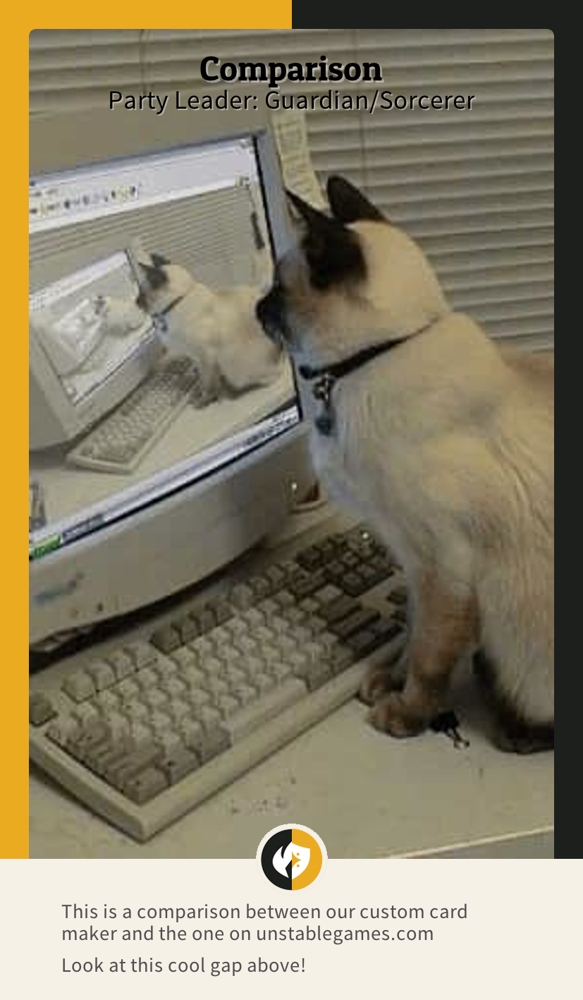
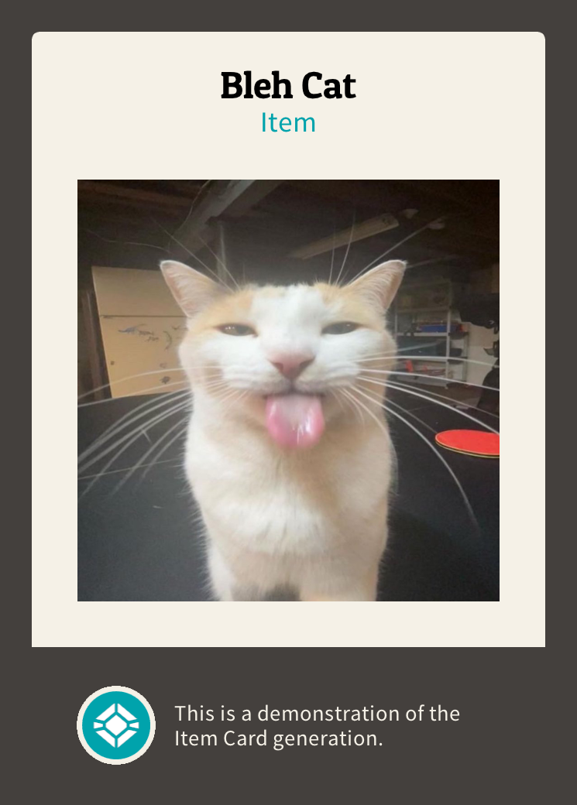
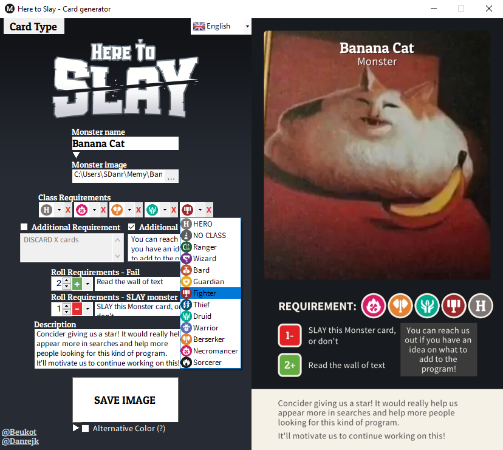

# Here To Slay - Custom Card Maker
Using this program you can make <b>accurate</b> custom cards (also with custom classes) for the card game "Here To Slay". The main goal of our program is to ensure that the generated cards follow the original designs as best as possible.
  
Polska wersja językowa: [README.pl.md](README.pl.md) 
Versione in lingua italiana: NESSUNA

## Instalation

 
Download the <code>.zip</code> file from the latest <b>Release</b> of the program displayed above, or on the right side of the page. 
Unzip it, the <code>.exe</code> is inside of it, it must remain along the other files inside of the folder or else the program will not work.

## Card Generation
There is an <a href="https://www.unstablegames.com/community-cards/here-to-slay">official creator</a> by the Here To Slay makers for leaders only, BUT it has so many inaccuracies that it barely represents the look of the real cards, AND it lacks <b>many</b> features
This program is what the official one should be, accurate and with more features:

### Leader
<table>
    <thead>
        <tr>
            <th colspan="2">Leader Generation</th>
        </tr>
        <tr>
            <th width="50%">Here To Slay - Custom Card Maker</td>
            <th width="50%">Maker on <a href="https://www.unstablegames.com/community-cards/here-to-slay">Unstablegames.com</a></th>
        </tr>
    </thead>
    <tbody>
        <tr>
            <td>✔️Includes ALL classes (from all DLCs).</td>
            <td>❌Has only base classes + Druid & Warrior.</td>
        </tr>
        <tr>
            <td>✔️Has Split-classes.</td>
            <td>❌Doesn't have Split-classes.</td>
        </tr> 
        <tr>
            <td>✔️Uses the correct fonts and their sizes.</td>
            <td>❌Uses a wrong font, with a wrong size for everything.</td>
        </tr> 
        <tr>
            <td>✔️The card has correct dimentions for printing.</td>
            <td>✔️The card has correct dimentions for printing.</td>
        </tr>
        <tr>
            <td>✔️Has correct borders.</td>
            <td>⚠️Has too thick borders.</td>
        </tr> 
        <tr>
            <td>✔️Max 5 lines of description (more don't fit)</td>
            <td>⚠️Max 120 characters. (~3 lines) of description</td>
        </tr> 
        <tr>
            <td>✔️Description text is aligned to the left.</td>
            <td>❌Description text is aligned to the center.</td>
        </tr> 
        <tr>
            <td>✔️Description Line breaks crate larger gaps between the lines.</td>
            <td>⚠️Description Line breaks simply go to the next line.</td>
        </tr>
        <tr>
            <td>✔️Uses black for the name and title text. (There's also a toggleable white color option)</td>
            <td>❌For some reason uses white for name and title text.</td>
        </tr> 
        <tr>
            <td>✔️Optional back gradient behind the name, which ISN't upside down.</td>
            <td>❌For some reason automatically includes a back gradient behind the name, which is upside down.</td>
        </tr>
        <tr>
            <td>⚠️Automatically crops the image to fit onto the card.</td>
            <td>⚠️Gives the user control over which parts are cut out, but it cuts out the edges (zooms in) no matter what you do.</td>
        </tr>
        <tr>
            <td>✔️Doesn't compress the image.</td>
            <td>❌Compresses the image.</td>
        </tr>
        <tr>
            <td>✔️Many more fine accuracy adjustments...</td>
            <td></td>
        </tr>
        <tr>
            <td>
                
  

            </td>
            <td>
                
  

            </td>
        </tr>
    </tbody>
</table>

### Monster

<table>
    <thead>
        <tr>
            <th width="500px">Monster Generation</th>
        </tr>
    </thead>
    <tbody>
        <tr><td>✔️✔️✔️Accurate Monster Card's design.</td></tr>
        <tr><td>⚠️Maximum 5 hero requirements.</td></tr>
        <tr><td>✔️Support for Additional Requirements (ex. "+ Discard Card").</td></tr>
        <tr><td>✔️Support for bonuses for each additional hero.</td></tr>
        <tr><td>✔️Fully customisable roll outcomes.</td></tr>
        <tr><td>✔️Optional Back Gradient and black name text.</td></tr>
        <tr><td>✔️Automatically orders class requirements to put generic Heros at the back.</td></tr>
        <tr><td>✔️Description Line breaks crate larger gaps between the lines.</td></tr>
        <tr><td>✔️Alternative card color for weaker printers.</td>
    </tbody>
</table>

 

    
### Hero

<table>
    <thead>
        <tr>
            <th width="500px">Hero Generation</th>
        </tr>
    </thead>
    <tbody>
        <tr><td>✔️✔️✔️Accurate Hero Card's design.</td></tr>
        <tr><td>✔️Fully customisable roll requirement.</td></tr>
        <tr><td>✔️Maximum 6 lines of description.</td></tr>
        <tr><td>✔️Description Line breaks crate larger gaps between the lines.</td></tr>
        <tr><td>✔️Customisable maximum items ammount.</td></tr>
        <tr><td>✔️Can disalow for items to be given to the card.</td></tr>
        <tr><td>❌No Here To Sleigh DLC present icon.</td></tr>
    </tbody>
</table>
 

### Item

<table>
    <thead>
        <tr>
            <th width="500px">Item Generation</th>
        </tr>
    </thead>
    <tbody>
        <tr><td>✔️✔️✔️Accurate Item Card's design.</td></tr>
        <tr><td>✔️Maximum 6 lines of description.</td></tr>
        <tr><td>✔️Description Line breaks crate larger gaps between the lines.</td></tr>
        <tr><td>✔️Has Item, Cursed Items, and Class specific item types.</td></tr>
    </tbody>
</table>
 

### Magic

<table>
    <thead>
        <tr>
            <th width="500px">Magic Generation</th>
        </tr>
    </thead>
    <tbody>
        <tr><td>✔️✔️✔️Accurate Magic Card's design.</td></tr>
        <tr><td>✔️Maximum 7 lines of description.</td></tr>
        <tr><td>✔️Description Line breaks crate larger gaps between the lines.</td></tr>
    </tbody>
</table>
 

## Custom Classes
The progam allows you to add your very own custom classes to the generator. With custom colors, custom icons and cusom names. The process of adding them is a bit rough around the edges, but it's fairly simple. 
First you will have to make a class icon. You can make it whatever you want, even a picture of your cat, but you have to follow all the steps for it to work. 
While making the icon, be sure to add an outline using the <code>#f5f1e7</code> color to match the design on the original cards. 
 
After you made the icon, you put it in the <code>Classes</code> folder, and you name it whatever you want. Just remember the name, you'll need it later. 

Then, you open the <code>ClassList.txt</code> file locaded also in the <code>Classes</code> folder. In the <code>ClassList.txt</code> file you have a list of all the classes that are currently in the maker. 
Each class has 4 values:
<ul>
    <li>English Name</li>
    <li>Name of the image file</li>
    <li>RGB color</li>
    <li>(optional) Polish Name</li>
</ul>

Each of the values are separated by a TAB character. Example: 

Name&emsp;image.png&emsp;255,128,0&emsp;PolishName

NOTES:
<ul>
    <li>The color RGB values MUST be separated by a comma.</li>
    <li>You don't have to put in the PolishName, you can just ignore it entirely.</li>
    <li>You image will not appear in the lists where you choose a class, but it will appear on the card itself, so don't worry.</li>
    <li>If it doesn't appear on the card, your image is either in bad format, or you named it wrong.</li>
</ul>

After you have done all that, you should see your very own Here To Slay custom class in the maker!

## Printing
### Printing at Home
In the files included with the program there are attached printing assets for printing at home. Backs of the cards for leaders, monsters and heros, their cards placements on A4 papers, as well as a template for positioning your own generated cards. 

 
Printing methods may differ depending on your printer, but what I found to work was to:
<ol>
    <li>Put a thicker A4 paper sheet into the printer.</li>
    <li>Align my generated cards like on the image on the right.</li>
    <li><b>ROTATE the image by 180°</b> to negate the default bottom margin on many printers.</li>
    <li>Print the front card with the setting to automatically crop the image <b>turned OFF</b>.</li>
    <li>Rotate the paper <b>ONLY on the Y axis</b> and put it back into the printer.</li>
    <li>Print the backsides of the cards, which are attached in the assets.</li>
</ol>
I hope this works for you as well, before printing with color I would test it by making a black ink only draft first, just to check if everything is aligned properly and has the right scale. 
You can of course print mixed card types on 1 piece of paper like: 1 Monster, 2 Leaders and 2 Heros on one piece of paper, but you gotta do some manual work and figure it out for your particular case yourself. 

### Printing Proffesionally
Unforunatelly I don't know how that works exactly. But I saw there are many posts about printing proffesionally on sites like reddit, so I reccomend you search there.

## Screenshots
<a>Screenshots are from before the v4.0 update. They will be soon updated</a>

    
     
    
     
    

