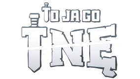

# To Ja Go Tnę - Kreator Własnych Kart
Dzięki temu programowi możesz tworzyć <b>dokładne</b> niestandardowe karty do gry karcianej "To Ja Go Tnę". Głównym celem naszego programu jest zapewnienie, że wygenerowane karty będą jak najbardziej zgodne z oryginalnymi wzorami, na tyle ile jest to możliwe.
  
English Version: [README.md](https://github.com/Danrejk/Here-To-Slay-Card-Maker/blob/main/README.md)

## Instalacja

 
Pobierz plik <code>.zip</code> z najnowszego <b>Release</b> programu wyświetlonego powyżej lub po prawej stronie strony. 
Rozpakuj go, a w środku znajdziesz plik <code>.exe</code>; musi pozostać wraz z innymi plikami w folderze, inaczej program nie będzie działać.

## Funkcje
Istnieje <a href="https://www.unstablegames.com/community-cards/here-to-slay">oficjalny kreator</a> stworzony przez twórców To Ja Go Tnę tylko do tworzenia przywódców, ALE ma tyle niedokładności, że ledwo odzwierciedla wygląd prawdziwych kart i BRAKUJE <b>wiele</b> funkcji.
Ten program to to, co powinno być oficjalnie wypuszczone - dokładne i z brakującymi funkcjami:

### Przywódcy
<table>
    <thead>
        <tr>
            <th colspan="2">Generacja Przywódców</th>
        </tr>
        <tr>
            <th width="50%">Here To Slay - Kreator Kart Własnych</td>
            <th width="50%">Kreator na <a href="https://www.unstablegames.com/community-cards/here-to-slay">Unstablegames.com</a></th>
        </tr>
    </thead>
    <tbody>
        <tr>
            <td>✔️ ZAWIERA PEŁNE WSPARCIE JĘZYKA POLSKIEGO 💪</td>
            <td>❌ Brak wsparcia :(</td>
        </tr>
        <tr>
            <td>✔️Zawiera WSZYSTKIE klasy (ze wszystkich DLC).</td>
            <td>❌Posiada tylko podstawowe klasy + Druida i Awanturnika.</td>
        </tr>
        <tr>
            <td>✔️Posiada podwójne klasy</td>
            <td>❌Nie posiada podwójnych klas.</td>
        </tr> 
        <tr>
            <td>✔️Używa właściwych czcionek i ich rozmiarów.</td>
            <td>❌Używa błędnej czcionki o niewłaściwym rozmiarze do wszystkiego.</td>
        </tr> 
        <tr>
            <td>✔️Karta ma poprawne wymiary do druku.</td>
            <td>✔️Karta ma poprawne wymiary do druku.</td>
        </tr>
        <tr>
            <td>✔️Posiada poprawne ramki.</td>
            <td>⚠️Posiada zbyt grube ramki.</td>
        </tr> 
        <tr>
            <td>✔️Maksimum 5 linijek opisu. (Więcej się nie mieści)</td>
            <td>⚠️Opisy mają maksymalnie 120 znaków (~3 linijki).</td>
        </tr> 
        <tr>
            <td>✔️Tekst opisu jest wyrównany do lewej.</td>
            <td>❌Tekst opisu jest wyrównany do środka.</td>
        </tr> 
        <tr>
            <td>✔️Przerwanie Linii tworzy większą przerwę między liniami.</td>
            <td>⚠️Przerwanie Linii najzwyczajniej przenosi do następnej linii.</td>
        </tr>
        <tr>
            <td>✔️Używa czarnego koloru dla nazwy i tytułu. (Istnieje również opcja przełączania na biały kolor)</td>
            <td>❌Z jakiegoś powodu używa białego koloru dla nazwy i tytułu.</td>
        </tr> 
        <tr>
            <td>✔️Ma opcjonalny gradient z tyłu nazwy, który NIE jest odwrócony do góry nogami.</td>
            <td>❌Automatycznie dodaje gradient z tyłu nazwy, który jest odwrócony do góry nogami.</td>
        </tr>
        <tr>
            <td>⚠️Automatycznie kadruje obraz, aby pasował na kartę.</td>
            <td>⚠️Daje użytkownikowi kontrolę nad tym, które fragmenty są wycinane, ale i tak zawsze wycina krawędzie, bez względu na to, co robisz.</td>
        </tr>
        <tr>
            <td>✔️Nie kompresuje obrazu.</td>
            <td>❌Kompresuje obraz.</td>
        </tr>
        <tr>
            <td>✔️Wiele innych drobnych dostosowań dokładności...</td>
            <td></td>
        </tr>
        <tr>
            <td>
                
  

            </td>
            <td>
                
  

            </td>
        </tr>
    </tbody>
</table>

### Potwory

<table>
    <thead>
        <tr>
            <th width="500px">Generacja Potworów</th>
        </tr>
    </thead>
    <tbody>
        <tr><td>✔️✔️✔️Dokładny design Karty Potwora.</td></tr>
        <tr><td>⚠️Maksymalnie 5 wymagań bohatera.</td></tr>
        <tr><td>✔️W pełni dostosowalne wyniki rzutu.</td></tr>
        <tr><td>✔️Opcjonalny gradient z tyłu i czarny tekst nazwy.</td></tr>
        <tr><td>✔️Automatyczne ustawianie wymagań klas, aby umieścić ogólnych bohaterów z tyłu.</td></tr>
        <tr><td>✔️Przerwanie Linii tworzy większą przerwę między liniami.</td></tr>
        <tr><td>✔️Alternatywny kolor karty dla słabszych drukarek.</td></tr>
        <tr><td>❌Brak opcji "+ Odrzuć Kartę" ... na razie.</td></tr>
        <tr><td>❌Brak premii do rzutu za każdą dodatkową kartę bohatera ... na razie.</td></tr>
    </tbody>
</table>

 

    
### Bohaterowie

<table>
    <thead>
        <tr>
            <th width="500px">Generacja Bohaterów</th>
        </tr>
    </thead>
    <tbody>
        <tr><td>✔️✔️✔️Dokładny design Karty Potwora.</td></tr>
        <tr><td>✔️W pełni dostosowalne wyniki rzutu.</td></tr>
        <tr><td>✔️Maksimum 6 linijek opisu.</td></tr>
        <tr><td>✔️Przerwanie Linii tworzy większą przerwę między liniami.</td></tr>
        <tr><td>✔️Dostosowalna maksymalna ilość przedmiotów.</td></tr>
        <tr><td>✔️Można zakazać dawania bohaterowi przedmiotów.</td></tr>
        <tr><td>❌Brak plakietek prezentów z DLC Here to Sleigh</td></tr>
    </tbody>
</table>

 

## Drukowanie
### Drukowanie w Domu
W plikach dołączonych do programu znajdują się zasoby do drukowania w domu. Tyły kart dla liderów, potworów i bohaterów, ich umieszczenie na papierze A4, a także szablon do pozycjonowania własnych wygenerowanych kart. Wszystkie assety są również dostępne z polskim logiem. 
Metody drukowania mogą się różnić w zależności od drukarki, ale to, co udało mi się sprawdzić, to:
<ol>

    <li>Włóż grubszą kartę A4 do drukarki</li>
    <li>Wyrównaj wygenerowane karty jak na obrazie po prawej stronie.</li>
    <li><b>OBRÓĆ obraz o 180°</b>, aby zniwelować domyślny margines dolny na wielu drukarkach.</li>
    <li>Wydrukuj przednią kartę z ustawieniem automatycznego przycinania obrazu <b>WYŁĄCZONE</b>.</li>
    <li>Obróć papier <b>TYLKO na osi Y</b> i wsuń go z powrotem do drukarki.</li>
    <li>Wydrukuj tyły kart, które są dołączone w zasobach.</li>
</ol>
Mam nadzieję, że to również zadziała u innych. Przed drukowaniem w kolorze zalecam przetestowanie go, wykonując pierwszy wers druku tylko czarnym tuszem, aby sprawdzić, czy wszystko jest odpowiednio wyrównane i ma właściwą skalę. 
Oczywiście można drukować różne typy kart na raz na tej samej kartce, np. 1 Potwór, 2 Przywódców i 2 Bohaterów, ale do tego trzeba odrobiny własnej pracy, aby dopasować wszystko do waszego przypadku.

### Drukowanie Profesjonalne
Niestety nie wiem dokładnie, jak to działa. Ale widziałem wiele postów na temat profesjonalnego drukowania tych kart na stronach takich jak reddit, więc polecam tam poszukać.

## Zrzuty Ekranu

    
     
    
     
    

